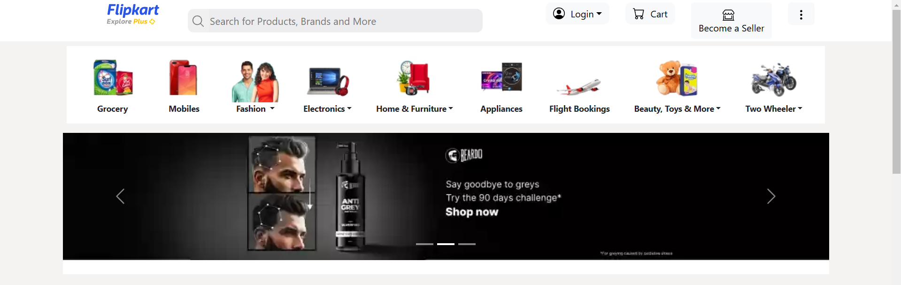
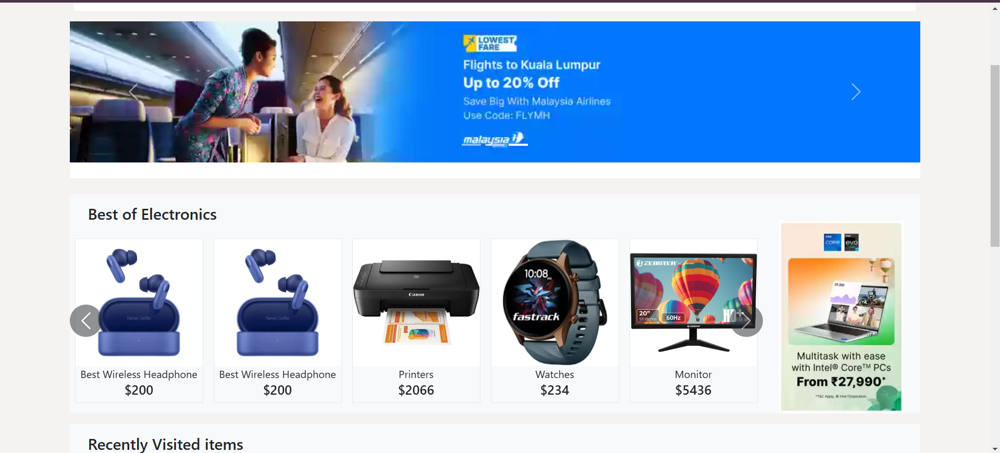
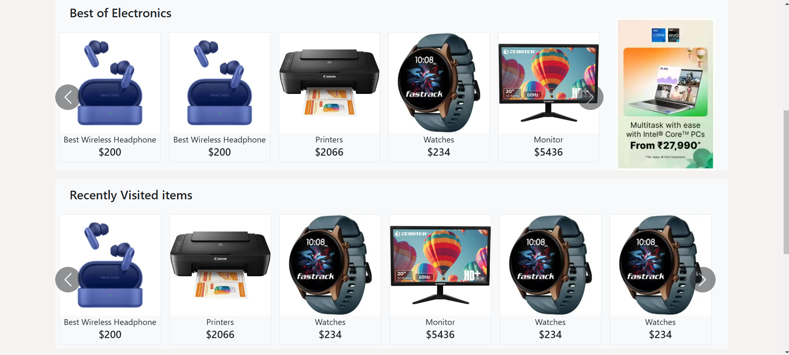
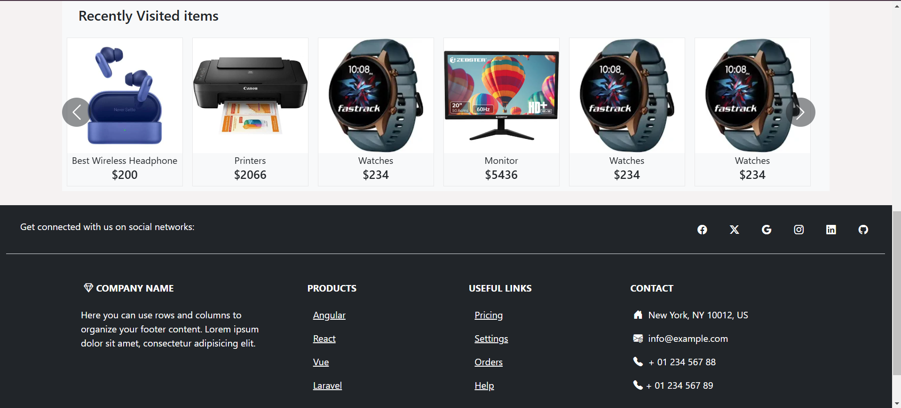

# Flipkart Home Page Replica

This project is a simple replica of the Flipkart home page created using **HTML**, **CSS**, and **Bootstrap**. It was developed as a practice project to enhance front-end development skills and learn responsive design.

---

## Features
- Responsive design using Bootstrap classes.
- Basic layout and styling with CSS.
- Header, navigation bar, product sections, and footer design.
- Improved understanding of web page structure.

---

## Purpose
The purpose of this task was:
1. To practice **HTML**, **CSS**, and **Bootstrap**.
2. To learn and apply responsive web design concepts.
3. To gain hands-on experience in creating a structured and styled web page.

---

## Technologies Used
- **HTML**: For structuring the content of the web page.
- **CSS**: For styling and improving the appearance of the page.
- **Bootstrap**: For responsive design and pre-built components.

---

## How to Run the Project
1. Clone the repository or download the ZIP file.
2. Open the `index.html` file in any web browser.
3. Explore the home page layout and design.

---

## Screenshots

---

## Learning Outcomes
- Improved understanding of **HTML tags** and structure.
- Learned to use **CSS** for layout and styling.
- Practiced **Bootstrap** for building responsive web pages efficiently.
- Gained experience in creating realistic UI designs.

---

## Acknowledgements
Special thanks to **Flipkart** for inspiring this design. This project is for educational purposes only and does not intend to replicate or replace the original website.
